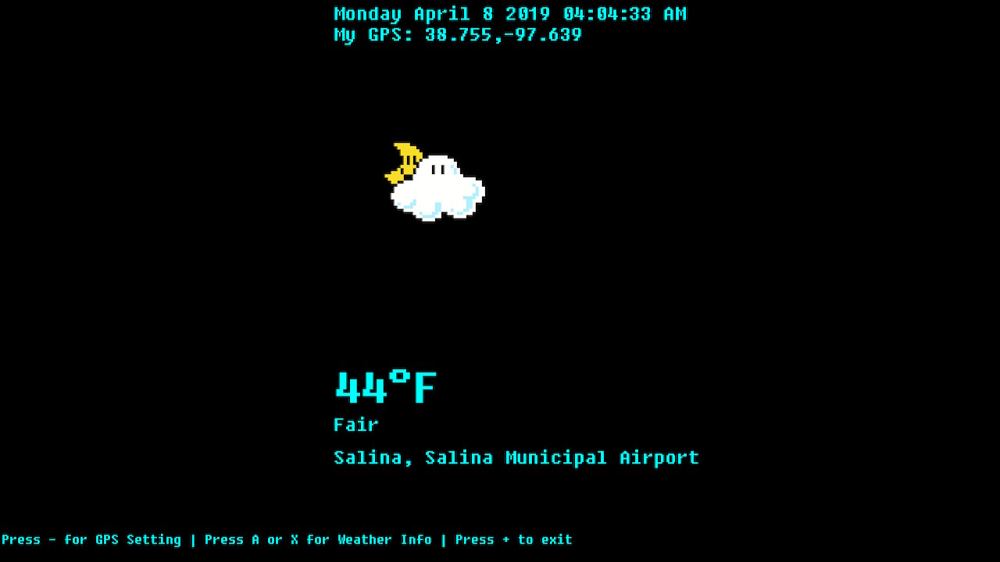

# Weather app for Nintendo Switch

# This app work best if you launch hbmenu via title replacment / one of your games on your switch.   the GPS settings would not pop up keyboard if you launch it thru hbmenu via nro.  Watch my video if you are not sure about how to launch the app.   

The video of the app in action on my switch:  https://youtu.be/pFggAxKcNsw

This weather homebrew app only get you weather info like Temp or Condition.  

you need to set your GPS in the setting by press - button.
It is important to not leave any spaces.  It must be like this 
40.1231,-90.3001

Press A or X to get weather info.  

Press + to exit to homebrew menu.   

   

Thanks/Credit to:  
https://github.com/switchbrew for Switch dev stuff
https://github.com/Dontwait00/nXDownload for download functions   
https://github.com/zserge/jsmn for JSON library